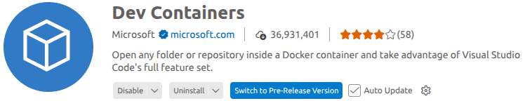

# Instalación del entorno de trabajo

Las herramientas para diseño de circuitos integrados, en general, son creadas originalmente para sistemas operativos basados en UNIX (como Linux), por lo tanto, el entorno de trabajo para este taller utiliza la distribución de Linux Ubuntu 22.04. Si es tu primera vez usando Linux, ¡no te preocupes! Solo haremos algunas cosas básicas como copiar archivos usando `cp` o movernos hacia rutas específicas con `cd`. Además, puedes consultar el al final de [Linux Cheatsheet](./digital_basics.pdf) para revisar comandos básicos.

## Git/GitHub

Como puedes ver, actualmente te encuentras en un repositorio de GitHub, pero ¿qué son exactamente Git y GitHub?

### ¿Qué es Git?

**Git** es un sistema de control de versiones gratuito que permite hacer seguimiento de los cambios en tus archivos. Imagina que estás escribiendo código y añades una nueva funcionalidad que lamentablemente produce errores, de tal modo que el programa ya no funciona. Sin Git, para volver a la versión que sí funcionaba, tendrías que acordarte de todos los cambios que realizaste y eliminarlos uno por uno. 

Con Git, puedes tomar una "fotografía" de tu código antes de hacer las modificaciones, de tal modo que siempre puedes volver a ese punto. En Git, esa fotografía se llama **commit**. Es como tener un botón de "deshacer" súper poderoso que te permite volver a cualquier punto anterior de tu proyecto.

### ¿Qué es GitHub?

**GitHub** es una plataforma en la nube que funciona como un "hogar" para tus proyectos que usan Git. Piensa en GitHub como un Google Drive especializado para proyectos de código. La ventaja es que múltiples personas pueden trabajar en el mismo proyecto sin pisarse los pies: cada uno hace sus cambios por separado y luego Git ayuda a combinar todo, resolviendo conflictos cuando dos personas modifican la misma línea de código de formas diferentes.

### Instalación de Git

Actualmente, te encuentras en un repositorio de GitHub donde están almacenados todos los archivos necesarios para realizar el taller. Para poder trabajar con estos archivos en tu computadora, necesitas **clonar** el repositorio (hacer una copia local). Pero primero, debes instalar Git.

1. **Instalar Git**: Ve a [Git Install](https://git-scm.com/install/windows) y sigue las instrucciones según tu sistema operativo (Windows, macOS, o Linux).

2. **Verificar la instalación**: Abre una terminal (PowerShell en Windows, Terminal en macOS, o Bash en Linux) y ejecuta:
```bash
$ git --version
```
Deberías ver algo como `git version 2.x.x`, lo que confirma que Git está instalado correctamente.

3. **Clonar el repositorio**: Una vez Git esté instalado, clona el repositorio con el comando:
```bash
$ git clone https://github.com/ChipUBB/digital-basic.git
```

4. **Navegar al repositorio**: Muévete hacia el directorio del repositorio con el comando:
```bash
$ cd ./digital-basic
```

## Docker y DevContainers

Ahora que tienes los archivos del taller en tu computadora, necesitamos configurar el entorno de trabajo. Aquí es donde entran Docker y DevContainers.

### ¿Qué es Docker?

**Docker** es una herramienta que permite crear "contenedores", imagínalos como cajas portátiles que incluyen todo lo necesario para ejecutar una aplicación: el sistema operativo, las herramientas, las bibliotecas, y las configuraciones. Es como tener una mini-computadora dentro de tu computadora, pero mucho más ligera y eficiente.

**¿Por qué es útil?** Sin Docker, cada persona tendría que instalar manualmente decenas de herramientas y configurarlas correctamente, lo cual es complicado y propenso a errores. Con Docker, todos trabajan en el mismo entorno exacto, sin importar si usas Windows, macOS, o Linux. Si funciona en tu computadora, funcionará en todas las demás.

### ¿Qué es un DevContainer?

Un **DevContainer** (Development Container) es una configuración especial de Docker diseñada específicamente para desarrollo de software. A diferencia de un contenedor normal de Docker (que típicamente ejecuta una aplicación en modo servidor o batch sin interacción directa), un **DevContainer** está pensado para que trabajes dentro de él como si fuera tu entorno de desarrollo local.

La diferencia clave es que con un DevContainer puedes usar **Visual Studio Code** (VS Code) de forma completamente integrada: abres VS Code en tu sistema operativo normal (Windows o Linux), pero todo el código se ejecuta, compila y prueba dentro del contenedor Linux. VS Code se conecta al contenedor de manera transparente, permitiéndote editar archivos, usar la terminal, instalar extensiones, y depurar código como si todo estuviera en tu máquina local, pero aprovechando todas las ventajas del contenedor (herramientas preinstaladas, mismo entorno para todos, aislamiento, etc.).

En este taller, el DevContainer ya viene con todo instalado y listo para usar: Digital, LibreLane, el PDK de IHP. Esto significa **cero configuración manual** de tu parte, simplemente abres el proyecto en VS Code, y automáticamente tendrás acceso a todas estas herramientas sin "ensuciar" tu sistema operativo con instalaciones complejas. Además, si mueves tu proyecto a otra computadora, todo seguirá funcionando exactamente igual porque el entorno completo viaja con el proyecto.

### Instalación y Configuración

#### Paso 1: Instalar Docker

La instalación de Docker varía según tu sistema operativo:

**Para Windows:**

1. Ve a [Docker Desktop](https://www.docker.com/products/docker-desktop/) y descarga Docker Desktop para Windows.
2. Instala Docker Desktop siguiendo el asistente de instalación.
3. Una vez instalado, abre Docker Desktop y espera a que inicie completamente (verás un ícono de Docker en tu barra de tareas).
4. Verifica la instalación abriendo PowerShell y ejecutando:
```bash
$ docker --version
```
   Deberías ver algo como `Docker version 24.x.x`.

**Para Linux:**

1. Sigue las instrucciones oficiales de Docker para tu distribución en [Docker Engine Install](https://docs.docker.com/engine/install/).
2. Para Ubuntu/Debian, los comandos básicos son:
```bash
$ sudo apt-get update
$ sudo apt-get install docker-ce docker-ce-cli containerd.io
```
3. Agrega tu usuario al grupo docker para no necesitar `sudo`:
```bash
$ sudo usermod -aG docker $USER
```
   Luego cierra sesión e inicia sesión nuevamente para que los cambios surtan efecto.

4. Verifica la instalación ejecutando:
```bash
$ docker --version
```
   Deberías ver algo como `Docker version 24.x.x`.

#### Paso 2: Instalar VcXsrv (Solo para Windows)

Las herramientas de diseño de circuitos integrados que usaremos (como Digital y herramientas de LibreLane) tienen interfaces gráficas que necesitan un servidor X11 para funcionar en Windows. **VcXsrv** proporciona este servidor, permitiendo que las aplicaciones gráficas de Linux dentro del contenedor se visualicen en tu escritorio de Windows.

**Instalación de VcXsrv:**

1. Ve a [VcXsrv en SourceForge](https://sourceforge.net/projects/vcxsrv/) y descarga el instalador.
2. Instala VcXsrv siguiendo el asistente de instalación con las opciones por defecto.
3. Una vez instalado, inicia **XLaunch** desde el menú de inicio.
4. Configura XLaunch con las siguientes opciones:
   - **Display settings**: Selecciona "Multiple windows" y deja el display number en -1, luego haz clic en "Next"
   - **Client startup**: Selecciona "Start no client", luego haz clic en "Next"
   - **Extra settings**: Marca la casilla "Disable access control", luego haz clic en "Next"
   - Haz clic en "Finish"

5. **Importante**: VcXsrv debe estar ejecutándose cada vez que quieras usar las herramientas gráficas. Verás un ícono de XLaunch en tu barra de tareas cuando esté activo.

**Nota para usuarios de Linux:** No necesitas instalar VcXsrv ya que Linux tiene soporte nativo para X11.

#### Paso 3: Instalar Visual Studio Code (VS Code)

**VS Code** es un editor de código moderno y gratuito que se integra perfectamente con DevContainers.

1. Ve a [Visual Studio Code](https://code.visualstudio.com/Download) y descarga el instalador para tu sistema operativo.
2. Instala VS Code siguiendo las instrucciones.

#### Paso 4: Instalar la extensión Dev Containers

1. Abre VS Code.
2. Ve a la sección de extensiones (ícono de cuadrados en la barra lateral izquierda, o presiona `Ctrl+Shift+X`).
3. Busca "**Dev Containers**" (o "Remote - Containers").
4. Haz clic en "Install" en la extensión publicada por Microsoft.



#### Paso 5: Abrir el proyecto en el DevContainer

1. **(Solo Windows)** Asegúrate de que VcXsrv esté ejecutándose antes de continuar (debe aparecer el ícono en la barra de tareas).

2. En VS Code, abre la carpeta del repositorio clonado:
   - Ve a `File > Open Folder...`
   - Navega hasta la carpeta `digital-basic` y ábrela

3. VS Code detectará automáticamente que hay una configuración de DevContainer en el proyecto. Verás una notificación en la esquina inferior derecha que dice: "Folder contains a Dev Container configuration file. Reopen folder to develop in a container".

4. Haz clic en "**Reopen in Container**" (o abre la paleta de comandos con `Ctrl+Shift+P` y busca "Dev Containers: Reopen in Container").

5. **Primera vez**: Docker descargará e instalará todas las herramientas necesarias. Este proceso puede tardar entre 10-20 minutos dependiendo de tu conexión a internet. ¡Ten paciencia! Solo sucede la primera vez.

6. Una vez completado, verás en la esquina inferior izquierda de VS Code un indicador que dice "**Dev Container: [nombre]**", confirmando que estás trabajando dentro del contenedor.

#### Paso 6: Verificar el entorno

Abre una terminal dentro de VS Code (`` Ctrl+` `` o `Terminal > New Terminal`) y verifica que las herramientas estén disponibles:
```bash
$ Digital
$ echo $PDK
```

Si ves Digital y la variable `PDK` configurada, ¡estás listo para comenzar el taller!

### Solución de problemas comunes

- **Docker Desktop no inicia (Windows)**: Asegúrate de que la virtualización esté habilitada en tu BIOS/UEFI.
- **El contenedor tarda mucho en construirse**: Es normal la primera vez. Las siguientes veces será instantáneo.
- **Error de permisos en Linux**: Asegúrate de haber agregado tu usuario al grupo `docker` y haber cerrado e iniciado sesión nuevamente.
- **Las ventanas gráficas no aparecen (Windows)**: Verifica que VcXsrv esté ejecutándose (ícono en la barra de tareas) y que hayas marcado "Disable access control" en la configuración.
- **Error de conexión X11 (Windows)**: Reinicia VcXsrv y asegúrate de seguir los pasos de configuración correctamente.