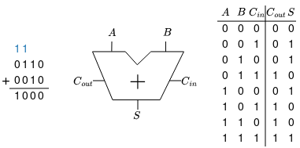
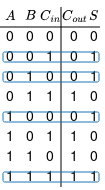
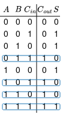
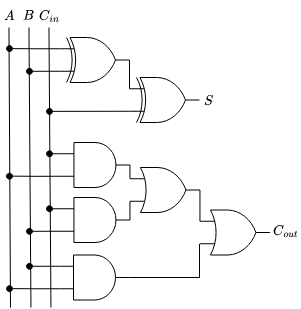

# ex01

En este ejercicio, trabajarás en el diseño y simulación de un **full adder** (sumador) de 1 bit para familiarizarte con el software de diseño lógico y simulación **Digital**. Las tareas son:

- Obtener la función booleana desde la tabla de verdad que describe el funcionamiento del circuito
- A partir de la función booleana, crear el esquemático en compuertas lógicas en el archivo `fulladder_1b.dig` con **Digital**
- Verificar el funcionamiento del circuito a través del **test** en el archivo

## Full Adder (1-bit)

Un **full adder** tiene 3 entradas, $A$, $B$ y $C_{in}$, y 2 salidas $S$ y $C_{out}$.



Para obtener las ecuaciones booleanas que nos permiten implementar el circuito, se emplea suma de productos (SOP, *Sum-of-Products)*, es decir, se suman los minitérminos para los que la salida es **TRUE**:

$S$:

|True Table|Boolean Eq|
|:---|:---|
||$S = \overline{A}\overline{B}C_{in} + \overline{A}B\overline{C_{in}} + A\overline{B}\overline{C_{in}} + ABC_{in}$ <br> $S = C_{in}(\overline{A}\overline{B} + AB) + \overline{C_{in}}(\overline{A}B +A\overline{B})$ <br> $S = C_{in}(\overline{A \oplus B}) + \overline{C_{in}}(A \oplus B)$ <br> $S = C_{in} \oplus A \oplus B$


$C_{out}$:

|True Table|Boolean Eq|
|:---|:---|
||$C_{out} = \overline{A}BC_{in} + A\overline{B}C_{in} + AB\overline{C_{in}} + ABC_{in}$<br>Usando Idempotency (T3): $B + B = B$, se tiene: <br> $C_{out} = \overline{A}BC_{in} + A\overline{B}C_{in} + AB\overline{C_{in}} + ABC_{in} + ABC_{in} + ABC_{in}$ <br> $C_{out} = BC_{in}(\overline{A} + A) + AC_{in}(\overline{B} + B) + AB(\overline{C_{in}} + C_{in})$ <br> $C_{out} = BC_{in} + AC_{in} + AB$

Circuito en compuertas lógicas (esquemático):



---
> ### Task 1
> 
> Crea y simula el circuito en **Digital**. Asegurate de que estás en `workspace/digital-basic/ex01` (puedes checkear con `pwd`) y abre el archivo `fulladder_1b.dig` con **Digital**:
>
>  ```
>  $ Digital fullader_1b.dig
>  ```
>
> Completa el esquemático utilizando compuertas lógicas, estas se encuentran en `Components/logic` en el menú superior de **Digital**.
>
>Ejecuta el **test** para verificar el funcionamiento del circuito haciendo click en el botón the **Run (play)** con el tick verde.

>
> [!CAUTION] 
> Las entradas y salidas del esquemático deben tener los mismos nombres que las definidas en el **test**. Se recomienda no modificar los nombres o bien hacerlo en ambas partes para evitar errores por diferencias de nombre.

---

## Appendix (LLM generated): Boolean Algebra Axioms and Theorems

### Axioms of Boolean Algebra

| ID | Axiom | Dual | Name |
|----|-------|------|------|
| A1 | $B = 0$ if $B \neq 1$ | $B = 1$ if $B \neq 0$ | Binary field |
| A2 | $\overline{0} = 1$ | $\overline{1} = 0$ | NOT |
| A3 | $0 \cdot 0 = 0$ | $1 + 1 = 1$ | AND/OR |
| A4 | $1 \cdot 1 = 1$ | $0 + 0 = 0$ | AND/OR |
| A5 | $0 \cdot 1 = 1 \cdot 0 = 0$ | $1 + 0 = 0 + 1 = 1$ | AND/OR |

### Theorems of Boolean Algebra

| ID | Theorem | Dual | Name |
|----|---------|------|------|
| T1 | $B \cdot 1 = B$ | $B + 0 = B$ | Identity |
| T2 | $B \cdot 0 = 0$ | $B + 1 = 1$ | Null Element |
| T3 | $B \cdot B = B$ | $B + B = B$ | Idempotency |
| T4 | $\overline{\overline{B}} = B$ | $\overline{\overline{B}} = B$ | Involution |
| T5 | $B \cdot \overline{B} = 0$ | $B + \overline{B} = 1$ | Complements |
| T6 | $B \cdot C = C \cdot B$ | $B + C = C + B$ | Commutativity |
| T7 | $(B \cdot C) \cdot D = B \cdot (C \cdot D)$ | $(B + C) + D = B + (C + D)$ | Associativity |
| T8 | $(B \cdot C) + (B \cdot D) = B \cdot (C + D)$ | $(B + C) \cdot (B + D) = B + (C \cdot D)$ | Distributivity |
| T9 | $B \cdot (B + C) = B$ | $B + (B \cdot C) = B$ | Covering |
| T10 | $(B \cdot C) + (B \cdot \overline{C}) = B$ | $(B + C) \cdot (B + \overline{C}) = B$ | Combining |
| T11 | $(B \cdot C) + (B \cdot D) + (C \cdot D) = (B \cdot C) + (\overline{B} \cdot D)$ | $(B + C) \cdot (B + D) \cdot (C + D) = (B + C) \cdot (\overline{B} + D)$ | Consensus |
| T12 | $\overline{B_0 \cdot B_1 \cdot B_2 \cdots} = (\overline{B_0} + \overline{B_1} + \overline{B_2} \cdots)$ | $\overline{B_0 + B_1 + B_2 \cdots} = (\overline{B_0} \cdot \overline{B_1} \cdot \overline{B_2} \cdots)$ | De Morgan's Theorem |

### Notes

- In Boolean algebra, $+$ represents the OR operation
- $\cdot$ represents the AND operation
- $\overline{B}$ represents the NOT operation (complement of B)
- The **Principle of Duality** states that any theorem or axiom remains valid if we interchange:
  - OR ($+$) with AND ($\cdot$)
  - $0$ with $1$
  - The dual of each expression is obtained by applying these interchanges