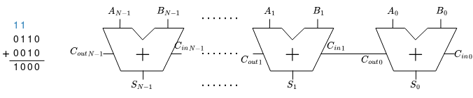
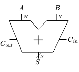
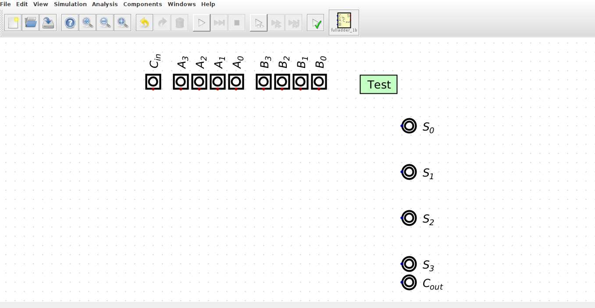
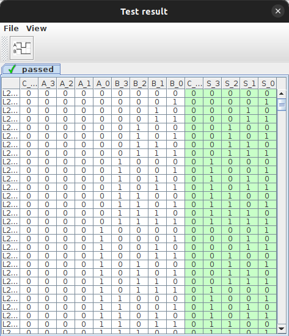

# ex02

En este ejercicio, trabajarás en el diseño y simulación de un **Adder** (sumador) de 4 bits, aprovechando la capacidad de diseño jerárquico de **Digital**. Las tareas son:

- Entender como realizar un diseño jerárquico en **Digital**
- Utilizar el **Full Adder** de `ex01` e instanciarlo en `adder_4b.dig` para construir un **Adder** de 4 bits
- Verificar el funcionamiento del circuito a través del **test** en el archivo

## Ripple-Carry Adder

Una forma sencilla de construir un **Adder** de $N$ bits es conectar en cadena $N$ **Full Adder**. Donde, la salida $C_{out}$ de una etapa actúa como entrada $C_{in}$ de la siguiente etapa (también conocido como **carry propagate adder (CPA)** ya que el $C_{out}$ se propaga hacia el siguiente $C_{in}$). 



El símbolo de un **CPA** es similiar al de un **Full Adder** pero se indica que las entradas $A$, $B$, y la salida $S$, son buses de $N$ bits.



Una desventaja de este circuito es que es lento si $N$ es grande, como cada etapa debe esperar que la etapa anterior haya finalizado el cómputo de $C_{out}$. Entre implementaciones que logran mayor velocidad en comparación al **Ripple-Carry Adder** se encuentran **Carry-Lookahead Adder** y **Prefix Adder**. 

---
> ### Task 1
> 
> Crea y simula en **Digital**, un **Ripple-Carry Adder** de 4 bits utilizando el **Full Adder** creado en `ex01`. Desde una terminal asegúrate de que estás en la ruta `workspace/digital-basic/ex02` (puedes checkear con `pwd`) y abre el archivo `adder_4b.dig` con **Digital**:
>
>  ```bash
>  $ Digital adder_4b.dig
>  ```
>
> El archivo contiene las entradas, salidas, así como un **test** para verificar el funcionamiento. Completa el esquemático instanciando el módulo `fulladder` desde `Components/Custom`.
>
> 
>
> 

> [!IMPORTANT] 
> Para poder instanciar un módulo desde un archivo `.dig`, el archivo debe estar en el mismo directorio de trabajo. Se recomienda crear una copia usando el explorador de archivos de `VSCode` o bien desde una terminal con el comando:
>
> ```bash
> $ cp ../ex01/fulladder.dig ./
> ```
>

> Ejecuta el **test** para verificar el funcionamiento del circuito haciendo click en el botón the **Run (play)** con el tick verde.
>
> Si el circuito fué implementado correctamente, la ventana emergente mostrará los valores de las salidas en verde. En caso contrario, algunos valores estarán en rojo.
>
> 

>
> [!CAUTION] 
> Las entradas y salidas del esquemático deben tener los mismos nombres que las definidas en el **test**. Se recomienda no modificar los nombres o bien hacerlo en ambas partes para evitar errores por diferencias de nombre.

---
