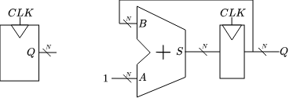
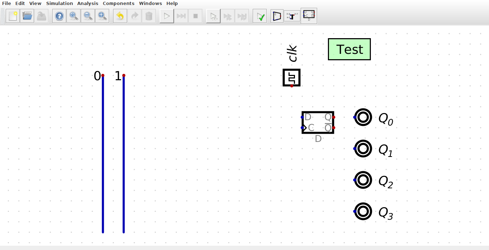
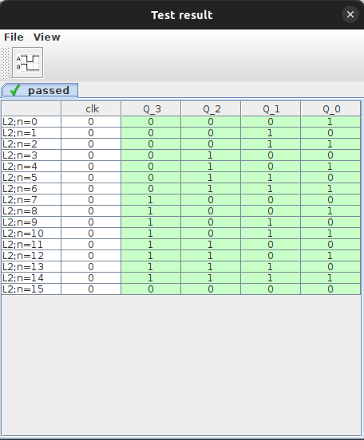

# ex03

En este ejercicio, trabajarás en el diseño y simulación de un **Counter** (contador) de 4 bits, aprovechando la capacidad de diseño jerárquico de **Digital**. Las tareas son:

- Entender como realizar un diseño jerárquico en **Digital** que incluye componentes secuenciales (**flip-flop**)
- Utilizar el **Adder** de `ex02` e instanciarlo en `counter_4b.dig` para construir un **Counter** de 4 bits
- Verificar el funcionamiento del circuito a través del **test** en el archivo

## Counter

Un **Counter** binario de $N$ bits es un circuito secuencial que recibe una señal de reloj $CLK$ y tiene una salida $Q$ de $N$ bits. Básicamente, en cada ciclo de reloj, la salida $Q$ aumenta en $1$. Por lo tanto, un **Counter** puede ser construido utilizando un **Adder** de $N$ bits y un **registro** de $N$ bits (o bien múltiples **flip-flop**), donde la salida del **registro** es realimentada a una de las entradas del **Adder** mientras la otra entrada recibe un $1$.



---
> ### Task 1
> 
> Crea y simula en **Digital**, un **Counter** de 4 bits utilizando el **Adder** creado en `ex02`. Desde una terminal asegúrate de que estás en la ruta `workspace/digital-basic/ex03` (puedes checkear con `pwd`) y abre el archivo `counter_4b.dig` con **Digital**:
>
>  ```bash
>  $ Digital counter_4b.dig
>  ```
>
> El archivo contiene las entradas, salidas, así como un **test** para verificar el funcionamiento. Completa el esquemático instanciando el módulo `adder_4b` desde `Components/Custom`.
>
> 

> [!NOTE]
> Para evitar desorden debido a excesivos cables (realimentación), se recomienda utilizar `Tunnel` (el componente con forma triangular) que se encuentra en `Components/wires`, estos permiten realizar conexiones sin necesidad de cables.

> Ejecuta el **test** para verificar el funcionamiento del circuito haciendo click en el botón the **Run (play)** con el tick verde.
>
> Si el circuito fué implementado correctamente, la ventana emergente mostrará los valores de las salidas en verde. En caso contrario, algunos valores estarán en rojo.
>
> 

>
> [!CAUTION] 
> Las entradas y salidas del esquemático deben tener los mismos nombres que las definidas en el **test**. Se recomienda no modificar los nombres o bien hacerlo en ambas partes para evitar errores por diferencias de nombre.

---

