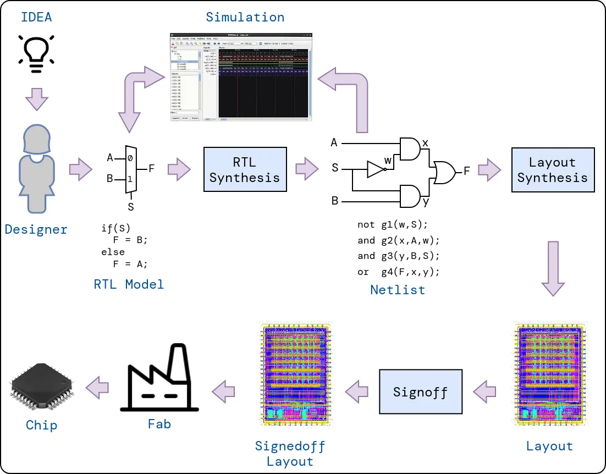
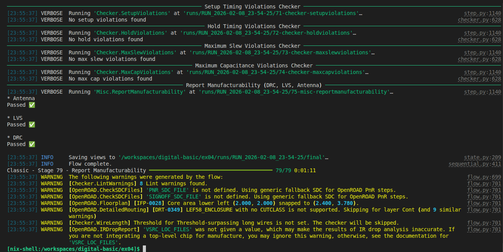

# ex04

En este ejercicio, trabajarás en el flujo de diseño de circuitos integrados (IC, Integrated Circuit) digitales, aprovechando la capacidad de **Digital** para obtener una descripción en algún lenguaje de descripción de hardware (HDL, Hardware Description Language) desde el esquemático y **Librelane** para obtener el GDS. Las tareas son:

- Entender conceptos del flujo de diseño de circuitos integrados digitales
- Exportar la descripción del **Counter** de `ex03` en **Verilog** usando **Digital**
- Enteder en que consiste **Librelane**, cómo configurar la herramienta, y pasar por el flujo automático RTL-to-GDS el **Counter** de `ex03`

## Overview de Diseño de ICs

Diseñar un chip es un tarea compleja que conlleva varias etapas (por eso se habla de flujo), así como expertis y atención a los detalles. Este proceso inicia con una idea de diseño (un circuito que resuelve algún problema) y finaliza al obtener todos los archivos necesarios para fabricar, los que posteriormente son enviados a una fábrica (foundry) donde el diseño es llevado al silicio. Algunas etapas del flujo de diseño son:

- **Design Entry**: En esta etapa, describimos cómo funcionará nuestro circuito usando un lenguaje llamado HDL (Lenguaje de Descripción de Hardware), como Verilog o VHDL. Es similar a escribir un programa, pero en lugar de crear software, estamos describiendo un circuito físico. Aquí definimos qué operaciones realizará el chip y cómo procesará la información.
- **Verification**: Antes de continuar, necesitamos asegurarnos de que nuestro diseño funciona correctamente. En esta etapa, probamos el circuito mediante simulaciones para detectar errores. Es como probar un videojuego antes de lanzarlo: queremos encontrar y corregir los problemas antes de fabricar el chip real, porque una vez fabricado, ¡no se puede modificar!
- **Synthesis**: Aquí es donde la magia comienza a suceder. La herramienta de síntesis toma nuestra descripción en HDL y la convierte en un circuito real hecho de compuertas lógicas (AND, OR, NOT, etc.). El resultado se llama **"Netlist"** y es básicamente una lista de todas las compuertas que necesitamos y cómo están conectadas entre sí.
- **Layout/Physical Synthesis**: Esta es una de las etapas más complejas. Tomamos el circuito de compuertas lógicas y lo convertimos en un plano físico que muestra exactamente dónde irá cada componente en el chip y cómo se conectarán. Esta etapa incluye varios pasos:

  - **Floorplaning**: Decidir dónde colocar los diferentes bloques del circuito
  - **Placement**: Ubicar cada compuerta en su posición específica
  - **Routing**: Trazar todas las conexiones entre componentes (como trazar cables en un circuito)

- **Signoff**: Esta es la etapa final donde hacemos una revisión exhaustiva de todo. Verificamos que el diseño funcione correctamente, que no consuma demasiada energía, y que cumpla con todos los requisitos. Solo después de esta aprobación final, el diseño está listo para enviarse a la fábrica donde se producirá el chip real.



### ¿Qué es un **PDK**?

Un **PDK** (Process Design Kit) es un conjunto de archivos que describe las capacidades de fabricación de una fábrica de semiconductores. Cada **foundry** (fábrica) cuenta con maquinaria especializada que le permite fabricar chips con características específicas, como el tamaño mínimo de los componentes y sus propiedades eléctricas. A este conjunto de capacidades y limitaciones se le denomina **proceso tecnológico**.

Para diseñar un chip que pueda ser fabricado, necesitamos un **PDK** que nos proporcione todos los detalles técnicos y las reglas de diseño del proceso tecnológico específico que vamos a utilizar. El **PDK** actúa como un puente entre nuestro diseño y las posibilidades reales de fabricación.
En este ejercicio trabajaremos con el **PDK** de código abierto (opensource) de IHP, que corresponde a un proceso tecnológico de 130 nanómetros (nm) `ihp-sg13g2`.

## Librelane

LibreLane es una herramienta de código abierto que facilita el diseño de chips digitales. Funciona como un "asistente automatizado" que organiza y coordina las diferentes etapas del proceso de diseño de circuitos integrados, permitiendo a los diseñadores crear chips sin necesidad de configurar manualmente cada herramienta.
Características principales:

  - **Fácil de usar**: LibreLane permite configurar todo el flujo de diseño mediante un único archivo de configuración, en lugar de tener que aprender a usar múltiples herramientas por separado.
  - **Basado en herramientas de código abierto**: Utiliza herramientas gratuitas y de acceso libre, lo que lo hace ideal para aprender y experimentar sin costos de licencias.
  - **Flexible**: Se puede personalizar según las necesidades específicas de cada proyecto, ya sea modificando el archivo de configuración o escribiendo scripts en **Python**.
  - **Comunidad activa**: Al ser un proyecto de código abierto, cuenta con una comunidad de usuarios que comparten conocimientos, recursos y soluciones a problemas comunes.

---
> ### Task 1
> 
> Exporta la descripción en HDL del **Counter** de 4 bits diseñado en `ex03` usando **Digital**. Desde una terminal asegúrate de que estás en la ruta `workspace/digital-basic/ex03` (puedes checkear con `pwd`) y abre el archivo `counter_4b.dig` con **Digital**:
>
>  ```bash
>  $ Digital counter_4b.dig
>  ```
>
> - ¿Cuál es el nombre del módulo top? (Este nombre lo necesitarás en la siguiente tarea)
>
> Copia el archivo Verilog generado al directorio `src` de `ex04`:
>
>  ```bash
>  $ cp counter_4b.v ../ex04/src/
>  ```
> ### Task 2
> 
> Pasa por el flujo default de **Librelane** el **Counter** de 4 bits utilizando el **PDK** de IHP. Desde una terminal asegúrate de que estás en la ruta `workspace/digital-basic/ex04` (puedes checkear con `pwd`). En este directorio hay un archivo `config.yaml` el cuál permite configurar **Librelane** y un directorio `src` (`ls` para listar el contenido del directorio).
>
> En primer lugar, verifica que la descripción en HDL exportada previamente se encuentre en `ex04/src`:
>
>  ```bash
>  $ ls src/
>  ```
> 
> Deberías ver el archivo `counter_4b.v` listado.
>
> El archivo `config.yaml` tiene el siguiente contenido:
>
>  ```yaml
>  DESIGN_NAME: <top module name>
>  VERILOG_FILES: dir::<path to source>
>  CLOCK_PERIOD: 25
>  CLOCK_PORT: clk
>
>  FP_SIZING: absolute
>  DIE_AREA:  [0.00, 0.00, 50.00, 50.00]
>  CORE_AREA: [2, 2, 48, 48]
>  ```
>
> - **DESIGN_NAME**: Nombre del módulo principal de tu diseño en Verilog. Es el módulo de nivel superior que contiene todo el circuito.
> - **VERILOG_FILES**: Ruta o directorio donde se encuentran los archivos fuente de Verilog que describen tu circuito.
> - **CLOCK_PERIOD**: Período de reloj en nanosegundos (ns). En este caso, 25 ns equivale a una frecuencia de 40 MHz. Este valor determina qué tan rápido funcionará el chip.
> - **CLOCK_PORT**: Nombre de la señal de reloj en tu diseño Verilog. Normalmente se llama clk.
> - **FP_SIZING**: Método de dimensionamiento del chip. absolute significa que especificaremos manualmente el tamaño exacto del chip usando coordenadas.
> - **DIE_AREA**: Área total del chip en micrómetros (μm), definida por las coordenadas [x_inicial, y_inicial, x_final, y_final]. En este caso: un cuadrado de 50 μm × 50 μm.
> - **CORE_AREA**: Área útil donde se colocarán los componentes del circuito, también en micrómetros. Aquí: un área de 46 μm × 46 μm (dejando 2 μm de margen en cada lado para conexiones y alimentación).
>
> Para configurar **Librelane** completa `config.yaml` con la información faltante, en este caso, **DESIGN_NAME** y **VERILOG_FILES**.
>
>Para utilizar **Librelane** invoca `nix-shell`, que hará que todos los paquetes incluidos con LibreLane estén disponibles para tu shell (este paso podría tardar ya que serán descargados algunos paquetes):
>
> ```
> $ nix-shell /opt/librelane/shell.nix
> ```
>
> Por defecto **Librelane** utiliza el **PDK** `sky130`. Sin embargo, el entorno de trabajo contiene 2 variables de entorno que indican a **Librelane** utilizar el **PDK** opensource de IHP `ihp-sg13g2`: `PDK` y `PDK_ROOT`, puedes verificar su contenido con:
>
> ```bash
> $ echo $PDK
> ```
> y
> ```bash
> $ echo $PDK_ROOT
> ```
>
>  Para lanzar **Librelane** corre el siguiente comando:
>
> ```bash
> $ librelane config.yaml
> ```
>
> Si todo va bien, el final de tu output debería lucir así:
>
> 
>
> Finalmente, usa el siguiente comando para visualizar el layout físico de tu circuito:
>
> ```bash
> $ librelane --last-run --flow openinopenroad config.yaml
> ```
>
> Esto abrirá una interfaz gráfica donde podrás explorar cómo quedaron distribuidos los componentes de tu contador en el chip.
>
> ### Felicitaciones ya puedes ver tu chip!!
>
---